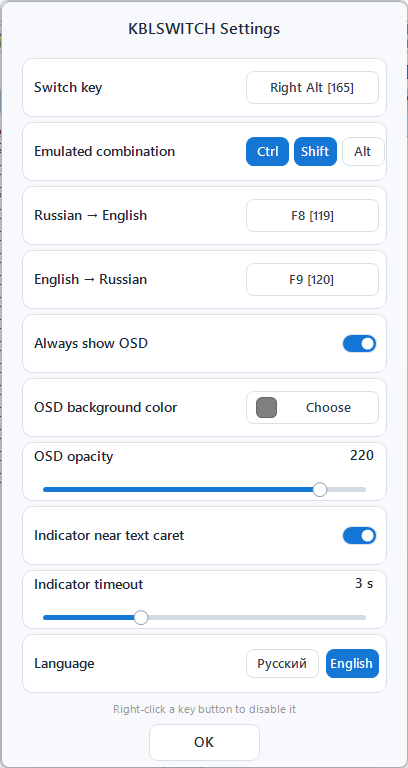
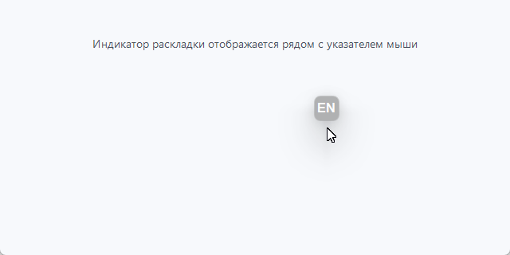

# kblswitch ⌨️

<p align="center">
  
</p>

**kblswitch** — сверхлёгкая утилита для Windows: переключение раскладки клавиатуры одной клавишей с визуальным уведомлением (OSD), исправлением раскладки последнего слова, индикатором раскладки у курсора ввода и многоязычным интерфейсом.

> Версия **2.0.1.0** · C++17 · Windows 10/11 · x64

Программа служит «мостом»: перехватывает удобную для вас клавишу (например, `Right Alt`) и эмулирует стандартную системную комбинацию (например, `Ctrl+Shift`), выводя при этом текущий язык ввода по центру экрана.

---

## 🖼️ Интерфейс

### Окно настроек

Все параметры применяются сразу и сохраняются в `kblswitch.ini` рядом с программой.



### Индикатор возле указателя мыши

Если приложение не предоставляет системную текстовую каретку (например, VS Code или Chromium), компактный индикатор фиксируется возле указателя мыши в момент переключения раскладки.



---

## ✨ Возможности

- **Переключение одной клавишей** — любая клавиша (по умолчанию Правый Alt) вместо неудобных сочетаний.
- **Поддержка системного `Ctrl+Shift`** — OSD корректно обновляется и в современных TSF-приложениях, включая Блокнот Windows 11.
- **Визуальное уведомление (OSD)** — полупрозрачное окно в центре экрана показывает текущий язык (EN, RU и т.д.) с плавным затуханием.
- **Режим «всегда на экране»** — OSD можно закрепить постоянно, перетаскивать мышью; позиция запоминается.
- **Индикатор раскладки у курсора ввода** — маленькое окно рядом с текстовой кареткой (или у указателя мыши, если приложение не предоставляет системную каретку, например VS Code / Chromium).
- **Исправление последнего слова** — `F8`: RU→EN, `F9`: EN→RU; после исправления ввод переключается на нужную раскладку.
- **Настройки в стиле Windows 11** — современное окно (GDI+), тёмная/светлая тема по системе, мгновенное применение изменений.
- **Многоязычность** — русский и английский; переключается в настройках; файлы `language\rus.lng`, `language\eng.lng`.
- **Контекстное меню** — Настройки / О программе / Выход (правый клик по иконке трея или по OSD).
- **Системный трей** — иконка для быстрого доступа.
- **Полная настройка** — параметры хранятся в `kblswitch.ini` рядом с программой.
- **Минимализм** — чистый WinAPI (C++17), минимум ресурсов, не требует установки.

---

## 🚀 Установка и использование

1. Скачайте архив `kblswitch-v2.0.1-windows-x64.zip` из последнего релиза или скомпилируйте программу сами (см. «Сборка»).
2. Распакуйте архив целиком: `kblswitch.exe` и папка `language\` должны находиться рядом.
3. Запустите `kblswitch.exe` — программа появится в системном трее.
4. Для автозагрузки добавьте ярлык программы в `shell:startup`.

**Управление:**
- Правый клик по иконке трея или по OSD — контекстное меню: Настройки • О программе • Выход.
- `Right Alt` (по умолчанию) — переключение раскладки.
- `F8` / `F9` — исправление раскладки последнего слова.

---

## ⚙️ Конфигурация (kblswitch.ini)

Файл `kblswitch.ini` создаётся автоматически рядом с программой при первом изменении настроек. Если файла нет — используются значения по умолчанию. Все параметры редактируются в окне настроек; файл можно править и вручную:

```ini
[Settings]
; Клавиша переключения раскладки (VK-код)
; 165 = VK_RMENU (Правый Alt), 91 = VK_LWIN, 20 = VK_CAPITAL
Key=165

; Исправление раскладки последнего слова (VK-код, 0 = отключить)
; 119 = F8: RU -> EN,  120 = F9: EN -> RU
FixRuToEnKey=119
FixEnToRuKey=120

; Системная комбинация, которую программа эмулирует (Ctrl, Shift, Alt через +)
Modifiers=Ctrl+Shift

; Цвет фона OSD в формате RRGGBB
Color=7F7F7F

; Постоянно показывать OSD (1/0)
always_show_osd=0

; Прозрачность OSD (0..255)
osd_alpha=220

; Индикатор раскладки у курсора ввода (1/0)
caret_indicator=1

; Таймаут автозакрытия индикатора, сек (0 = не закрывать)
indicator_timeout=3

; Язык интерфейса: 1 = русский, 2 = английский
Language=1
```

---

## 🌍 Языки

Интерфейс поддерживает русский и английский. Язык выбирается в настройках и хранится в `Language` файла `kblswitch.ini`. Тексты находятся в файлах `language\rus.lng` и `language\eng.lng` (формат `ключ=значение`, UTF-8). Если файл языка отсутствует или повреждён — используется встроенный русский словарь.

---

## 🛠️ Сборка из исходного кода

Требования: Windows 10/11, **Visual Studio 2022** (или Build Tools) с компонентом C++, **CMake** (для способа 2).

### Способ 1: build.bat (простая сборка через MSVC)

```bat
build.bat
```

Результат: `build\bin\Release\kblswitch.exe` (вместе с `language\` и `app.ico`).

Перед сборкой скрипт останавливает запущенный `kblswitch.exe` и ждёт освобождения файла. Если программа запущена с повышенными правами, `build.bat` также нужно запускать от администратора.

### Способ 2: CMake

```bat
cmake -S . -B build -G "Visual Studio 17 2022" -A x64
cmake --build build --config Release
```

Или просто `build_cmake.bat`. Подробнее — в [README_CMAKE.md](README_CMAKE.md).

### Непрерывная сборка

В репозитории есть GitHub Actions workflow (`.github/workflows/build.yml`): собирает проект на `windows-latest` и выкладывает артефакт с `kblswitch.exe` и папкой `language\`.

---

## 📁 Структура проекта

```
kblswitch.h            Общий заголовок: константы, extern-глобальные переменные, прототипы
kblswitch.cpp          Ядро: скрытое окно сообщений, жизненный цикл, диспетчеризация
input.cpp              Низкоуровневый хук клавиатуры + исправление раскладки слова
overlay.cpp            OSD-окно, индикатор у каретки, имя раскладки, позиция в реестре
tray_menu.cpp          Иконка трея и контекстное меню (owner-draw, глифы)
settings_apply.cpp     Загрузка/применение настроек к работающему приложению
setting.cpp            Окно настроек (GDI+, стиль Windows 11)
lng_manager.cpp/.h     Менеджер языков (RU/EN, фолбэк)
resource.rc/.h         Ресурсы EXE: иконка, версия 2.0.1.0
app.ico                Многоразмерная Windows-иконка (16–256 px)
assets/app-icon.svg    Векторный мастер: две симметрично наложенные полые трубы 2/4/2 и оранжевый центр
assets/app-icon.png    Прозрачный PNG-рендер векторного мастера
language/              Языковые файлы (rus.lng, eng.lng)
docs/screenshots/      Скриншоты интерфейса для документации
build.bat              Скрипт сборки (MSVC)
CMakeLists.txt         Конфигурация CMake
.github/workflows/     CI (GitHub Actions)
```

---

## 🔒 Безопасность и ограничения

- Приложение использует **низкоуровневый хук клавиатуры** (`WH_KEYBOARD_LL`) и может эмулировать нажатия через `SendInput` — это необходимо для работы. Инжектированные события (`LLKHF_INJECTED`) не обрабатываются повторно, чтобы не создавать зацикливание.
- **Не собирает и не передаёт никаких данных.** Вся конфигурация хранится локально в `kblswitch.ini`; позиция OSD — в реестре (`HKCU\Software\KBLSwitch`). Сеть не используется.
- Антивирус может предупреждать о клавиатурных хуках — это нормально для подобных утилит. Скачивайте только официальные релизы.
- Требуются права обычного пользователя; UAC-повышение не нужно.

---

## 📄 Лицензия

Распространяется под лицензией [MIT](LICENSE).

## 🤝 Вклад

Форки, pull request'ы и issue приветствуются. Пожалуйста, описывайте изменения в коммитах по-русски или по-английски.
